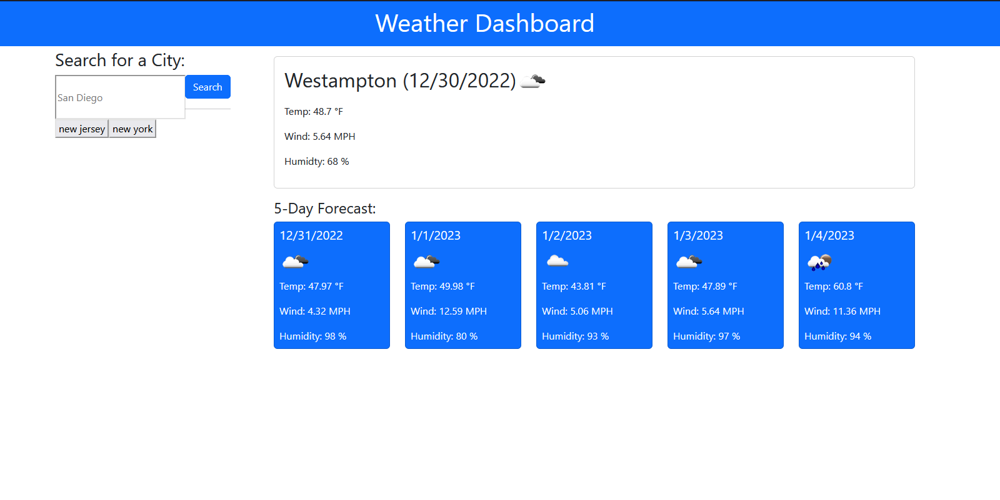

# Weather Dashboard
The purpose of this application is to be able to see the weather outlook for multiple cities thereby making it easy to plan a trip according to the weather at the destination.

## Usage
The user is presented with a weather dashboard with form inputs. When the user searched for a city they are presented with current and future conditions for that city and that city is added to the search history. When the user views current weather conditions for a given city they are also presnted with the city name, date, icon represntation of weather conditions, the temperature, wind speed and the humidity. 

## Screenshots

## Link

https://parkercf.github.io/Weather-Dashboard/

## Features

- uses third-party API
- uses localStorage
- uses javascript
- dynamically updated CSS
- dynamically updated HTML

## License

[MIT](https://choosealicense.com/licenses/mit/)

